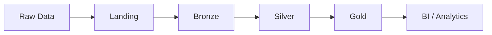

# Healthcare Lakehouse – Databricks

Projeto **end-to-end de engenharia de dados** que simula o ambiente analítico de uma operadora de saúde utilizando **Databricks Lakehouse** e **arquitetura Medallion**.

O objetivo é construir uma pipeline capaz de integrar múltiplas fontes de dados do ecossistema de **saúde suplementar** e disponibilizar dados confiáveis para análises operacionais e estratégicas.

O projeto reproduz cenários comuns do setor, como:

- análise de churn de beneficiários  
- monitoramento de utilização assistencial  
- análise de inadimplência de faturas  
- monitoramento da experiência do cliente (SAC / NPS)  
- análise de comportamento digital via logs de aplicativo  

---

# Arquitetura Lakehouse

A pipeline segue o padrão **Medallion Architecture**, amplamente utilizado em ambientes Lakehouse.

| Camada | Objetivo |
|------|------|
| landing | recepção de dados brutos provenientes de sistemas externos |
| bronze | ingestão dos dados em Delta preservando a origem |
| silver | limpeza, tipagem e validação de dados |
| gold | datasets analíticos para consumo de BI |

Fluxo da pipeline:

Landing → Bronze → Silver → Gold

# Camada Silver (tratamento por domínio)

A camada **Silver** é responsável por transformar os dados da Bronze (raw / string-first) em tabelas **tipadas, padronizadas e validadas**, prontas para análises e para alimentar a camada Gold.

## Estratégia adotada
implementa **um notebook por domínio**, permitindo:
- falhas isoladas (um domínio não derruba os demais)
- reprocessamento seletivo
- ownership/organização por tema (financeiro, assistencial, experiência, digital)

Cada notebook Silver segue o mesmo padrão:

1. **Contexto** (`USE CATALOG ...`)
2. **Criação de schemas** (`silver`, `silver_rejects`, `silver_ops`)
3. **Checkpoint** (`silver_ops.pipeline_checkpoint`) para processamento incremental por `ingestion_ts`
4. **Tabelas destino** (`silver.<tabela>` e `silver_rejects.<tabela>`)
5. **Leitura incremental do Bronze** (com janela de segurança)
6. **Tipagem + padronização** (`TRY_CAST`, `TRY_TO_TIMESTAMP`, `UPPER/TRIM`, regras simples de domínio)
7. **Deduplicação determinística** (`row_number()` por chave natural, ordenando por `ingestion_ts`)
8. **Regras de qualidade** com `reject_reason`
9. **Persistência de rejects** (quarentena com motivo)
10. **Idempotência** via `row_hash` + **MERGE** (Delta)
11. **Atualização do checkpoint**
12. **Sanity checks** (contagens, distribuição de motivos/flags)

## Tratamento: rejects vs flags
Nem toda anomalia deve virar rejeição:
- **Rejects** para erros estruturais (ex.: chave ausente, data inválida)
- **Flags** para inconsistências não-bloqueantes (ex.: `http_status` inválido em logs, valores negativos em lançamentos assistenciais), preservando o registro na Silver para análise e auditoria.

## Notebooks Silver implementados
- `02_silver_00_setup.sql`
- `02_silver_dim_beneficiarios.sql`
- `02_silver_contratos.sql`
- `02_silver_faturas.sql`
- `02_silver_eventos.sql`
- `02_silver_sac.sql`
- `02_silver_app_logs.sql`
- `02_silver_ops_quality.sql`

# Observabilidade (DataOps) - Qualidade da Silver

O notebook `02_silver_ops_quality.sql` consolida métricas operacionais de qualidade e execução:

- volumes totais de `silver` e `silver_rejects`
- % de rejeição total e **% do último load** (via `load_id`)
- top `reject_reason` do último load por tabela
- checkpoints (última execução por tabela)
- persistência de snapshots em `silver_ops.quality_report_history` para histórico e tendência

# Camada Gold (marts e KPIs para BI)

A camada **Gold** materializa **produtos de dados** prontos para consumo (BI/Analytics), consolidando a visão de negócio em métricas acionáveis para **saúde suplementar**.

## Tabelas Gold implementadas
- `gold.mart_member_month`: base mensal por beneficiário (`beneficiario_id` x `competencia`) consolidando sinais Financeiro + Assistencial + Experiência + Digital
- `gold.kpi_sinistralidade`: custo/uso mensal por recortes (UF, segmento, rede, tipo_evento, cid_grupo) + PMPM (proxy)
- `gold.kpi_churn_admin`: inadimplência por competência/UF/segmento (proxy de churn administrativo)
- `gold.kpi_experiencia`: experiência por competência/UF/segmento (SAC + digital)
- `gold.mart_kpi_executivo`: visão executiva mensal (churn admin + custo + experiência)

## Notebooks Gold implementados
- `03_gold_00_setup.sql`
- `03_gold_mart_member_month.sql`
- `03_gold_kpi_sinistralidade.sql`
- `03_gold_kpi_churn_admin.sql`
- `03_gold_kpi_experiencia.sql`
- `03_gold_mart_kpi_executivo.sql`

## Gold Ops (observabilidade)
- `gold_ops.pipeline_checkpoint`: controle de execução
- `gold_ops.quality_report_history`: histórico de snapshots da Gold
- `03_gold_ops_00_setup.sql`
- `03_gold_ops_quality.sql`: contagens, freshness (max competência), sanity checks e persistência de snapshots

## Diagrama da arquitetura



---

# Organização da Landing

A camada **landing** utiliza volumes do Unity Catalog para organizar arquivos brutos.

| Volume | Função |
|------|------|
| landing.raw | arquivos recebidos das fontes |
| landing.stage | arquivos preparados para ingestão |
| landing.archive | histórico de arquivos processados |

---

# Estratégia de ingestão

Diferentes formatos de arquivos exigem estratégias diferentes de ingestão.

| Formato | Estratégia |
|------|------|
| CSV | COPY INTO |
| JSONL | PySpark read.json |
| Parquet | PySpark read.parquet |
| Excel | conversão para CSV (staging) |

Decisões importantes:

- dados mantidos como **STRING na Bronze**
- tipagem aplicada apenas na **Silver**
- dados sujos preservados na Bronze para diagnóstico

---

# Fontes de dados simuladas

O projeto utiliza datasets sintéticos que representam diferentes sistemas da operadora.

| Dataset | Origem simulada | Descrição |
|------|------|------|
| cadastro_beneficiarios | sistema cadastral | dados demográficos |
| contratos_planos | sistema comercial | histórico de contratos |
| eventos_assistenciais | sistema hospitalar | consultas e procedimentos |
| faturas_pagamentos | sistema financeiro | faturamento e pagamentos |
| sac_srp_manifestacoes | CRM | reclamações e NPS |
| app_event_log | aplicativo mobile | comportamento digital |

---

# Tecnologias utilizadas

- Databricks Lakehouse  
- Databricks SQL  
- PySpark  
- Delta Lake  
- Unity Catalog  
- Power BI  
- Git / GitHub  

---

# Estrutura do projeto
```text
healthcare-lakehouse-databricks/
│
├── docs/
│   └── arquitetura_medallion.md
│
├── data/
│   └── raw/
│   └── sample/
│     |── cadastro_beneficiarios_sample.csv
│     |── eventos_assistenciais_sample.parquet
│
├── notebooks/
│   ├── 00_lakehouse_setup
│   ├── 01_bronze_ingestao
│   ├── 01_bronze_quality_assessment
│   ├── 02_silver_00_setup.sql
│   ├── 02_silver_dim_beneficiarios.sql
│   ├── 02_silver_contratos.sql
│   ├── 02_silver_faturas.sql
│   ├── 02_silver_eventos.sql
│   ├── 02_silver_sac.sql
│   ├── 02_silver_app_logs.sql
│   ├── 02_silver_ops_quality.sql
│   ├── 03_gold_00_setup.sql
│   ├── 03_gold_mart_member_month.sql
│   ├── 03_gold_kpi_sinistralidade.sql
│   ├── 03_gold_kpi_churn_admin.sql
│   ├── 03_gold_kpi_experiencia.sql
│   ├── 03_gold_mart_kpi_executivo.sql
│   ├── 03_gold_ops_00_setup.sql
│   ├── 03_gold_ops_quality.sql
│
├── src/
│   └── geracao_dados/
|   └── amostragem/
│
├── sql/
├── assets/
└── powerbi/
```

---

# Sobre os dados

Os datasets utilizados neste projeto são **dados sintéticos gerados para fins de prática em ambiente real**.

Para evitar repositórios muito pesados, o GitHub contém apenas **amostras de dados** na pasta:

data/sample


Os dados completos podem ser gerados novamente utilizando os scripts presentes em:

src/geracao_dados

---

# Objetivo analítico do projeto

O Lakehouse construído neste projeto permite responder perguntas importantes para operadoras de saúde:

- Quais fatores estão associados ao churn de beneficiários?
- Quais perfis de cliente apresentam maior utilização assistencial?
- Existe relação entre reclamações no SAC e cancelamento de contrato?
- Quais planos apresentam maior risco de inadimplência?
- Como o comportamento no aplicativo se relaciona com retenção de clientes?

---

# Licença

Projeto educacional para fins de estudo em engenharia de dados e analytics.

# Autor

Rodrigo Neves