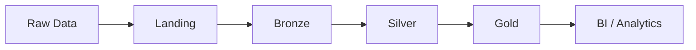

# Healthcare Lakehouse – Databricks

Projeto **end-to-end de engenharia de dados** que simula o ambiente analítico de uma operadora de saúde utilizando **Databricks Lakehouse** e **arquitetura Medallion**.

O objetivo é construir uma pipeline capaz de integrar múltiplas fontes de dados do ecossistema de **saúde suplementar** e disponibilizar dados confiáveis para análises operacionais e estratégicas.

O projeto reproduz cenários comuns do setor, como:

- análise de churn de beneficiários  
- monitoramento de utilização assistencial  
- análise de inadimplência de faturas  
- monitoramento da experiência do cliente (SAC / NPS)  
- análise de comportamento digital via logs de aplicativo  

---

# Arquitetura Lakehouse

A pipeline segue o padrão **Medallion Architecture**, amplamente utilizado em ambientes Lakehouse.

| Camada | Objetivo |
|------|------|
| landing | recepção de dados brutos provenientes de sistemas externos |
| bronze | ingestão dos dados em Delta preservando a origem |
| silver | limpeza, tipagem e validação de dados |
| gold | datasets analíticos para consumo de BI |

Fluxo da pipeline:

Landing → Bronze → Silver → Gold

## Diagrama da arquitetura



---

# Organização da Landing

A camada **landing** utiliza volumes do Unity Catalog para organizar arquivos brutos.

| Volume | Função |
|------|------|
| landing.raw | arquivos recebidos das fontes |
| landing.stage | arquivos preparados para ingestão |
| landing.archive | histórico de arquivos processados |

---

# Estratégia de ingestão

Diferentes formatos de arquivos exigem estratégias diferentes de ingestão.

| Formato | Estratégia |
|------|------|
| CSV | COPY INTO |
| JSONL | PySpark read.json |
| Parquet | PySpark read.parquet |
| Excel | conversão para CSV (staging) |

Decisões importantes:

- dados mantidos como **STRING na Bronze**
- tipagem aplicada apenas na **Silver**
- dados sujos preservados na Bronze para diagnóstico

---

# Fontes de dados simuladas

O projeto utiliza datasets sintéticos que representam diferentes sistemas da operadora.

| Dataset | Origem simulada | Descrição |
|------|------|------|
| cadastro_beneficiarios | sistema cadastral | dados demográficos |
| contratos_planos | sistema comercial | histórico de contratos |
| eventos_assistenciais | sistema hospitalar | consultas e procedimentos |
| faturas_pagamentos | sistema financeiro | faturamento e pagamentos |
| sac_srp_manifestacoes | CRM | reclamações e NPS |
| app_event_log | aplicativo mobile | comportamento digital |

---

# Tecnologias utilizadas

- Databricks Lakehouse  
- Databricks SQL  
- PySpark  
- Delta Lake  
- Unity Catalog  
- Power BI  
- Git / GitHub  

---

# Estrutura do projeto
```text
healthcare-lakehouse-databricks/
│
├── docs/
│   └── arquitetura_medallion.md
│
├── data/
│   └── raw/
│   └── sample/
│     |── cadastro_beneficiarios_sample.csv
│     |── eventos_assistenciais_sample.parquet
│
├── notebooks/
│   ├── 00_lakehouse_setup
│   ├── 01_bronze_ingestao
│   ├── 01_bronze_quality_assessment
│
├── src/
│   └── geracao_dados/
|   └── amostragem/
│
├── sql/
├── assets/
└── powerbi/
```

---

# Sobre os dados

Os datasets utilizados neste projeto são **dados sintéticos gerados para fins de prática em ambiente real**.

Para evitar repositórios muito pesados, o GitHub contém apenas **amostras de dados** na pasta:

data/sample


Os dados completos podem ser gerados novamente utilizando os scripts presentes em:

src/geracao_dados

---

# Objetivo analítico do projeto

O Lakehouse construído neste projeto permite responder perguntas importantes para operadoras de saúde:

- Quais fatores estão associados ao churn de beneficiários?
- Quais perfis de cliente apresentam maior utilização assistencial?
- Existe relação entre reclamações no SAC e cancelamento de contrato?
- Quais planos apresentam maior risco de inadimplência?
- Como o comportamento no aplicativo se relaciona com retenção de clientes?

---

# Licença

Projeto educacional para fins de estudo em engenharia de dados e analytics.

# Autor

Rodrigo Neves