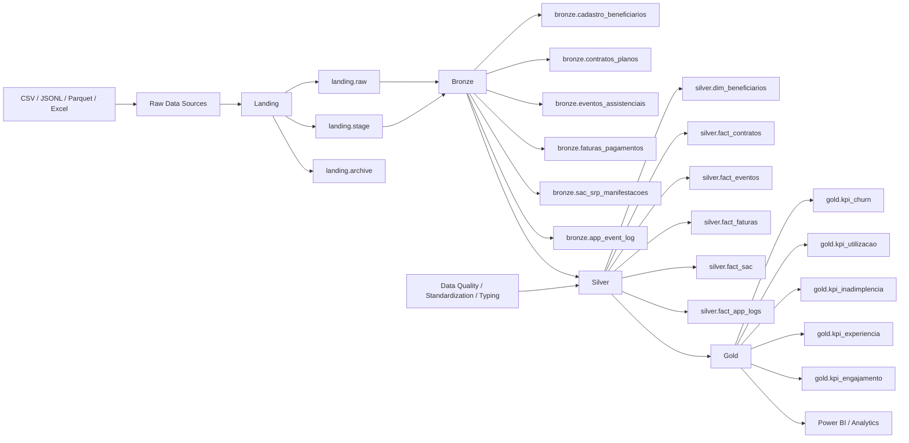

# Arquitetura Medallion

Este projeto utiliza o padrão **Medallion Architecture**, amplamente adotado em ambientes Lakehouse para organizar pipelines de dados em camadas progressivas de qualidade.

A arquitetura separa o processamento em diferentes níveis de refinamento, permitindo melhor governança, rastreabilidade e qualidade dos dados.

---
## Diagrama completo da arquitetura

---

# Camada 00_landing

A camada landing é responsável por receber os dados brutos provenientes de sistemas externos.

Nesta etapa os dados são armazenados exatamente como foram recebidos, sem qualquer transformação.

Tipos de arquivos utilizados neste projeto:

- CSV
- JSONL
- Parquet
- Excel

Os arquivos são armazenados em **volumes do Unity Catalog**.

Exemplos de datasets nesta camada:

- cadastro_beneficiarios.csv
- contratos_planos.csv
- eventos_assistenciais.parquet
- faturas_pagamentos.jsonl
- sac_srp_manifestacoes.xlsx
- app_event_log.jsonl

Essa camada garante rastreabilidade e permite reprocessamento completo da pipeline.

---

# Camada 01_bronze

A camada bronze realiza a ingestão dos dados brutos em tabelas **Delta Lake**.

Objetivos da camada:

- preservar os dados próximos à origem
- padronizar formato de armazenamento
- permitir ingestão incremental

Neste projeto a ingestão é realizada utilizando **COPY INTO**, permitindo ingestão idempotente de arquivos provenientes da camada landing.

Nesta etapa os dados recebem transformação mínima.

Em muitos casos os campos são armazenados como **STRING**, evitando conflitos de schema durante ingestão.

---

# Camada 02_silver

A camada silver é responsável pelo tratamento e validação dos dados.

Principais operações realizadas:

- remoção de duplicidades
- padronização de categorias
- tratamento de valores nulos
- correção de inconsistências de datas
- validação de regras de negócio
- conversão de tipos de dados

Exemplos de validações:

- contratos com data_fim_vigencia menor que data_inicio_vigencia
- valores negativos em faturamento
- duplicidade de beneficiários
- inconsistências em categorias de SAC

Após essas etapas os dados tornam-se confiáveis para análise.

---

# Camada 03_gold

A camada gold contém datasets modelados para consumo analítico.

Nesta etapa são criados:

- datasets analíticos
- agregações de métricas
- indicadores de negócio

Exemplos de datasets desta camada:

- churn de beneficiários
- utilização assistencial
- inadimplência por plano
- indicadores de experiência do cliente

Esses dados são consumidos por ferramentas de BI como **Power BI**.

---

# Benefícios da arquitetura

A arquitetura Medallion proporciona:

- separação clara entre ingestão, tratamento e consumo
- maior governança de dados
- facilidade de auditoria
- reprocessamento seguro
- escalabilidade da pipeline